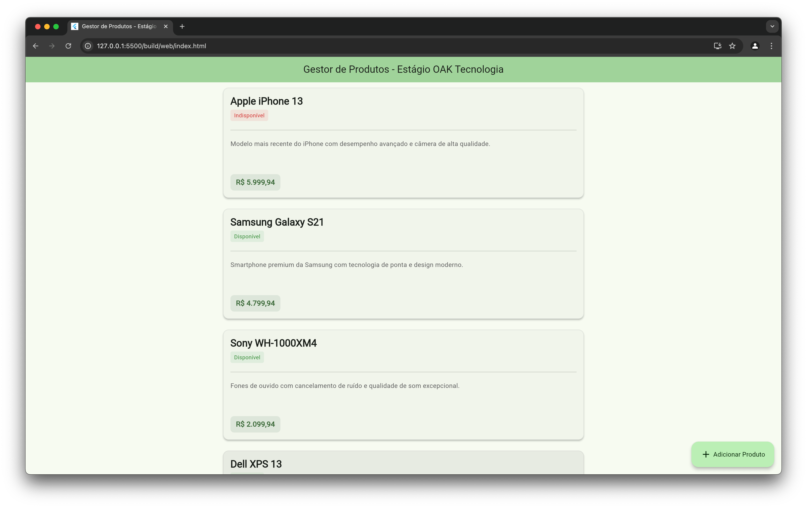
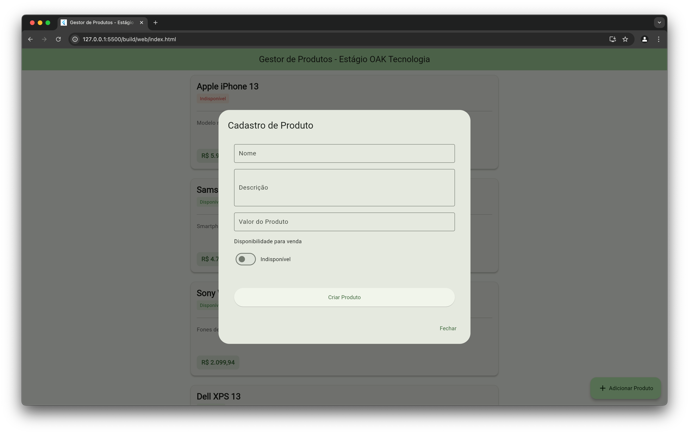
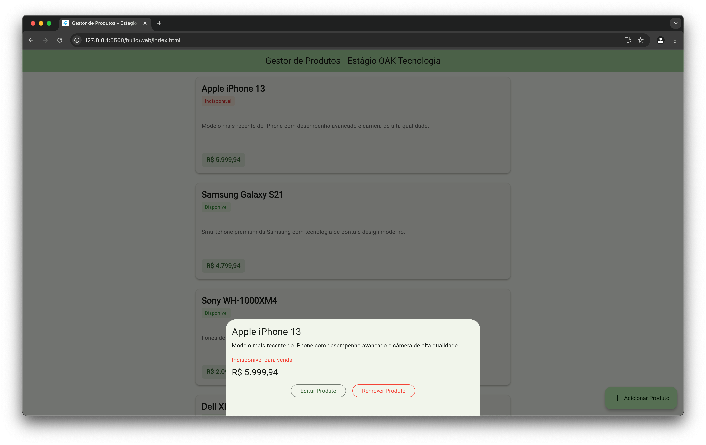
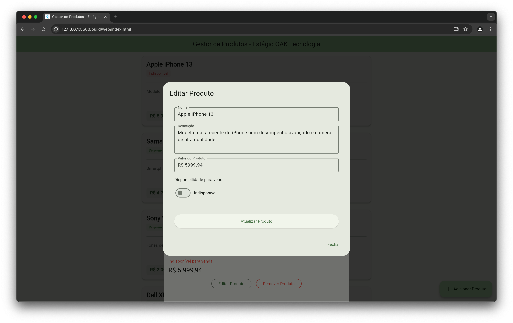

# Oak Estágio Project

Um simples sistema de cadastro e listagem de produtos desenvolvido em Flutter, oferecendo uma interface para gerenciamento de produtos.

## 📱 Funcionalidades

- Cadastro de novos produtos com informações detalhadas
- Listagem de produtos com interface responsiva
- Edição de produtos existentes
- Remoção de produtos
- Visualização detalhada de cada produto

## 🚀 Instalação

### Pré-requisitos

- Dart / Flutter
- Git

Para instalar o Flutter, siga as instruções no [site oficial do Flutter](https://flutter.dev/docs/get-started/install) de acordo com seu sistema operacional.

### Passos para Instalação

1. Clone o repositório:
```sh
git clone https://github.com/seu-usuario/oak_estagio_project.git
```

2. Navegue até o diretório do projeto:
```sh
cd oak_estagio_project
```

3. Instale as dependências:
```sh
flutter pub get
```

4. Execute o aplicativo:
```sh
flutter run
```

## 🛠️ Tecnologias Utilizadas

- Flutter
- Dart

## 📸 Capturas de Tela

### Página Inicial
A tela inicial apresenta uma lista organizada de todos os produtos cadastrados.



### Tela de Cadastro
Interface intuitiva para adicionar novos produtos ao sistema.



### Detalhes do Produto
Visualização detalhada ao clicar em um produto específico.



### Edição de Produto
Tela para modificar as informações de produtos existentes.



## 🤝 Como Contribuir

1. Faça um Fork do projeto
2. Crie uma Branch para sua Feature (`git checkout -b feature/AmazingFeature`)
3. Adicione suas mudanças (`git add .`)
4. Commit suas mudanças (`git commit -m 'Adicionando uma Feature incrível!'`)
5. Push para a Branch (`git push origin feature/AmazingFeature`)
6. Abra um Pull Request

## 📄 Licença

Este projeto está sob a licença MIT. Veja o arquivo [LICENSE](LICENSE) para mais detalhes.